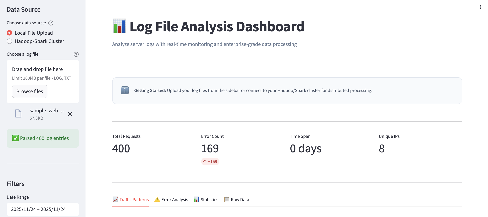
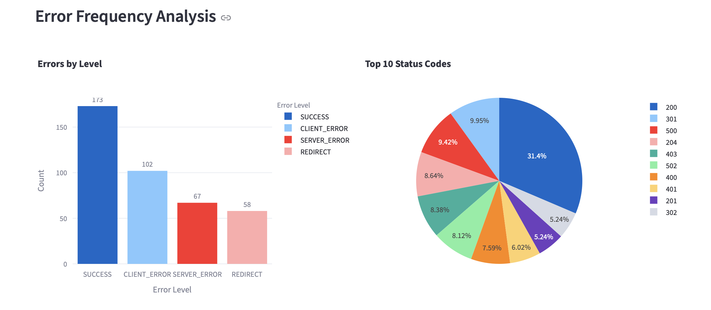
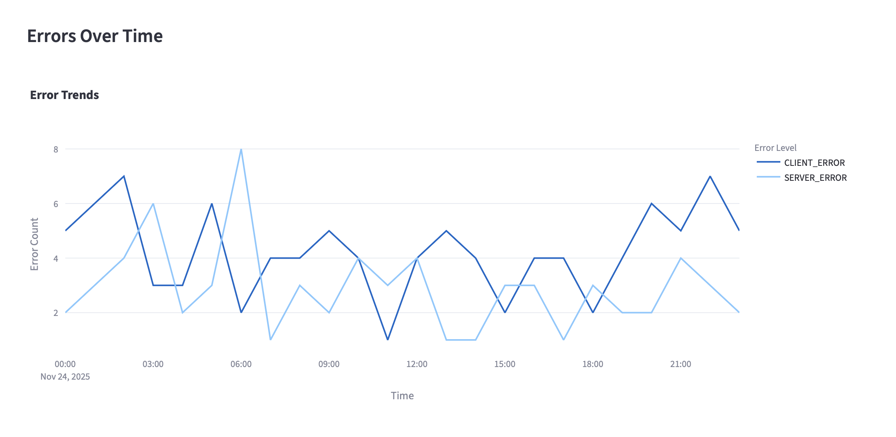
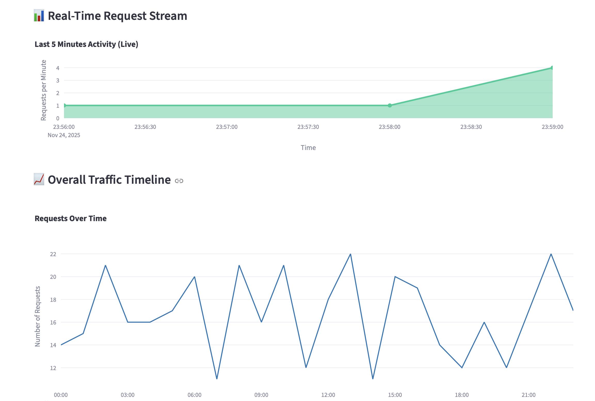
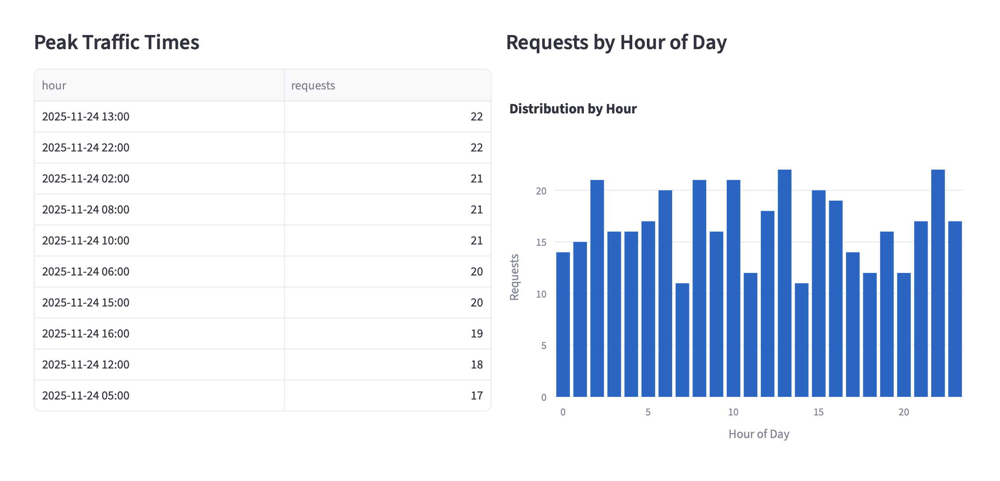
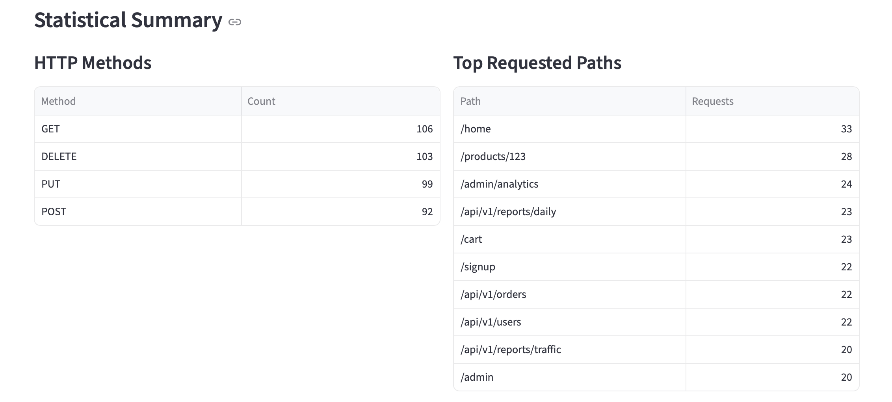
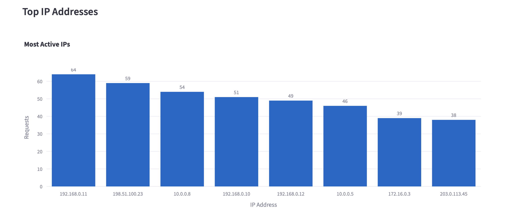
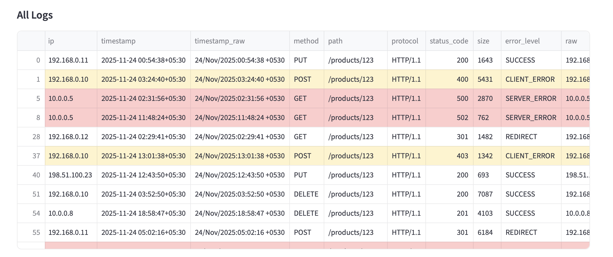

# Log Analysis Dashboard with Hadoop/Spark Integration

Academic project: an end-to-end **log file monitoring and analysis system** that can run locally on a laptop and conceptually scale to a **Hadoop + Spark** big-data cluster.

It reads raw web server logs, parses and cleans them in Python, computes key metrics **(traffic, errors, endpoints, IPs)**, and shows everything in an interactive **Streamlit dashboard**.  
Optionally, it can connect to a backend API in front of a Hadoop/Spark cluster to pull logs from HDFS and submit distributed jobs.

---

## ⭐ Key Features

- **Web-based dashboard (Streamlit)**
  - Upload log files and analyze them instantly
  - Clean, card-style layout for summary metrics
  - Interactive charts and tables

- **Log parsing engine (`log_parser.py`)**
  - Designed for Apache/Nginx–style access logs
  - Extracts IP, timestamp, method, URL, status code, response size, etc.
  - Handles noisy / slightly irregular lines safely

- **Core analytics**
  - Total requests, unique IPs
  - Status code breakdown (2xx / 3xx / 4xx / 5xx)
  - Top endpoints, methods, error URLs
  - Time-series traffic and error trends

- **Big-data ready (conceptual)**
  - Reads from local files **or** HDFS (via backend)
  - `backend_connector.py` and `api_server.py` show how to plug in a real Hadoop/Spark cluster behind the UI

---

## 🧱 Architecture

### High-level Flow

      ┌─────────────────────────────────────────┐
      │              Streamlit UI               │
      │  - File upload (local)                  │
      │  - HDFS path input (cluster)           │
      │  - Visual dashboards                   │
      │  - Optional AI Q&A                     │
      └───────────────────┬────────────────────┘
                          │ (HTTP / REST, optional)
                          ▼
      ┌─────────────────────────────────────────┐
      │       Backend API / Cluster Layer      │
      │  - api_server.py (Flask example)       │
      │  - Talks to Hadoop/Spark/HDFS         │
      │  - Returns logs / aggregated results   │
      └────────────────────────────────────────┘

# 📸 Screenshots

### Dashboard – Summary View


### Error Analysis



### Traffic Patterns



### Statistics



### All Logs


### Repository Structure
```text
Log-analysis-hadoop-spark/
│
├── app.py                         # Streamlit dashboard (main UI)
├── log_parser.py                  # Log parsing + DataFrame creation
├── backend_connector.py           # Client for REST API / cluster
├── api_server.py                  # Example Flask API for HDFS/Spark
│
├── sample_web_access_log_bigdata.log  # Example log file
│
├── BACKEND_SETUP.md               # Hadoop/Spark + REST API setup
├── QUICKSTART.md                  # Super short run guide
└── (this) README.md               # Overview + documentation

